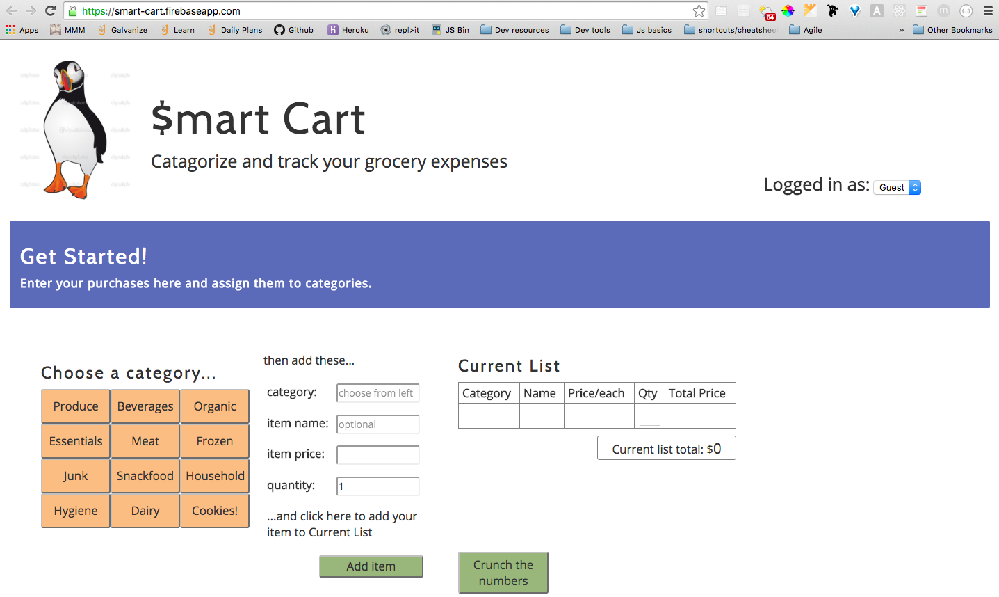

# Smart-Cart
A web app for tracking grocery spending. Users can choose categories that are useful for them, and then enter individual costs into each category. 

https://smart-cart.firebaseapp.com/

